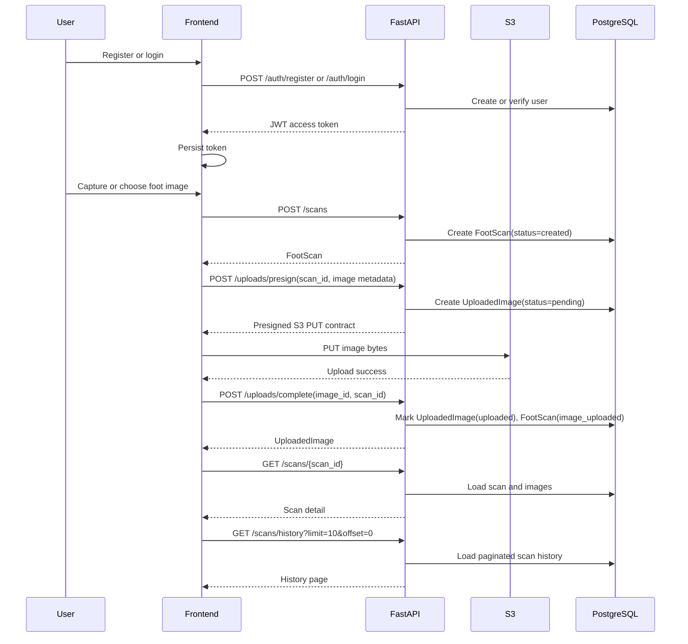

# Phase 2 Workflow Notes

## Updated Architecture Notes

Phase 2 completes the user-facing scan workflow while keeping the AI layer unchanged.

### Frontend Changes

- JWT authentication is persisted in browser `localStorage`.
- Authenticated pages are guarded by a shared `ProtectedRoute`.
- Login and registration forms call the backend authentication APIs.
- Dashboard reads paginated scan history and summarizes scan activity.
- New scan workflow supports foot-side selection, camera capture, direct image upload, upload progress, and scan-detail redirect.
- Camera capture uses the browser MediaDevices API, renders a preview, supports retake, and uploads the accepted image.
- Scan history is paginated and links to individual scan detail pages.
- Scan detail shows status, associated uploaded image metadata, timestamps, and placeholder measurement state.

### Backend Changes

- `POST /uploads/presign` validates optional `foot_scan_id` ownership before issuing an upload contract.
- S3 object keys now include scan context when a scan is known:

```text
users/{user_id}/scans/{scan_id}/{generated_file_name}
```

- `POST /uploads/complete` can attach an uploaded image to a scan and moves scan status to `image_uploaded`.
- `GET /scans` supports `limit` and `offset`.
- `GET /scans/history` returns paginated history with total count, upload count, and recommendation count.
- `GET /scans/{scan_id}` returns scan detail plus attached uploaded images.

## API Flow Diagram



## Testing Checklist

### Authentication

- Register with a valid email and password of at least 10 characters.
- Confirm duplicate registration returns a visible error.
- Login with valid credentials.
- Confirm invalid login returns a visible error.
- Refresh `/dashboard` and verify the JWT session is restored.
- Sign out and confirm protected routes redirect to `/login`.

### Scan Creation

- Open `/scans/new`.
- Select left foot and open camera.
- Return and select right foot, then open camera.
- Upload a local JPG, PNG, or WebP file directly from `/scans/new`.
- Confirm oversized or unsupported images show a clear error from validation.

### Camera Capture

- Open `/camera` on a browser with camera permission.
- Grant camera permission and confirm live preview appears.
- Capture an image and confirm preview appears.
- Retake the image and confirm live capture resumes.
- Use the photo and confirm upload progress reaches 100%.
- Confirm the app redirects to `/scans/{scan_id}`.

### Scan Detail

- Confirm scan status is `Image uploaded` after upload completion.
- Confirm attached image metadata appears.
- Refresh scan detail and confirm status persists.
- Use the refresh button and confirm the page reloads scan state.

### Scan History

- Open `/scans`.
- Confirm created scans appear newest-first.
- Confirm pagination buttons disable correctly at the beginning and end.
- Open a scan from the table and confirm the detail page loads.

### Backend

- Verify `POST /uploads/presign` rejects a scan ID owned by another user.
- Verify `POST /uploads/complete` rejects an image ID owned by another user.
- Verify `GET /scans/history?limit=10&offset=0` returns `items`, `total`, `limit`, and `offset`.
- Verify the AI routes still import and behave as placeholders.

## Database Migration Updates

No new database migration is required for Phase 2.

The initial schema already included the required relationship:

```sql
uploaded_images.foot_scan_id UUID REFERENCES foot_scans(id)
```

Phase 2 uses that existing column to associate uploaded images with scans and updates existing `status` string values.
