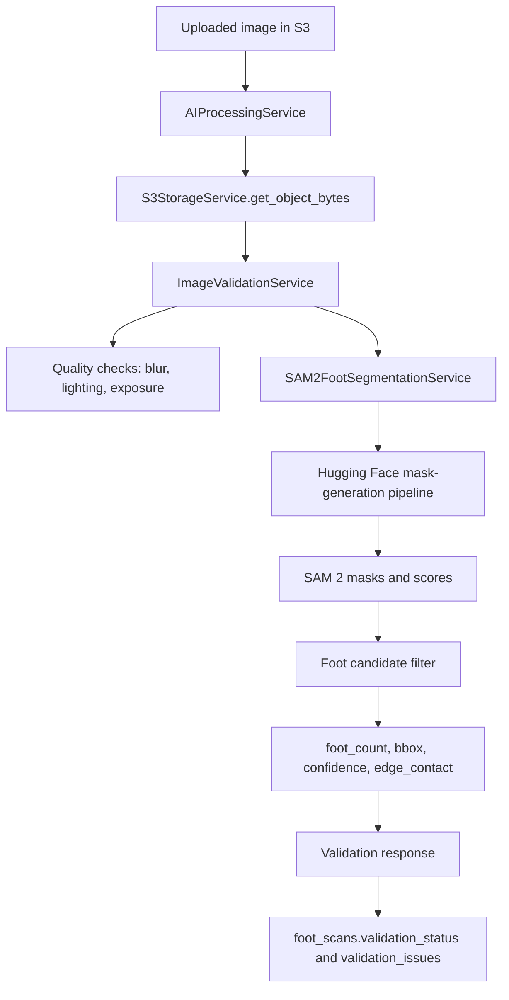

# Phase 3B SAM 2 Foot Segmentation

## Goal

Phase 3B replaces heuristic foot-frame analysis with SAM 2-backed segmentation from Hugging Face. It focuses only on segmentation and validation readiness.

This phase does not implement measurement logic or shoe size recommendations.

## Service Design

### `SAM2FootSegmentationService`

Location: `backend/app/services/ai/sam2_foot_segmentation_service.py`

Implements:

`FootSegmentationService`

Responsibilities:

- Load SAM 2 through Hugging Face Transformers.
- Generate segmentation masks for uploaded foot images.
- Filter plausible foot candidates from SAM 2 masks.
- Return:
  - mask count as `foot_count`
  - primary foot bounding box
  - segmentation confidence
  - edge contact detection
  - per-foot candidate metadata

SAM 2 is class-agnostic. The current service uses SAM 2 masks as the boundary source of truth, then filters plausible foot candidates by mask area, confidence, and shape. A later classifier can be added without changing the validation API.

## Service Diagram



## API Output

`POST /api/v1/ai/scans/{scan_id}/validate`

Example:

```json
{
  "valid": true,
  "issues": [],
  "foot_count": 1,
  "segmentation_confidence": 0.96,
  "foot_bbox": {
    "x": 120,
    "y": 80,
    "width": 620,
    "height": 340
  }
}
```

The existing `valid` and `issues` API contract is preserved.

## Hugging Face Dependency List

Runtime Python packages:

- `transformers>=4.57.0`
- `torch>=2.6.0`
- `numpy>=2.0.0`
- `pillow>=11.0.0`

Default model:

- `facebook/sam2.1-hiera-large`

Relevant environment variables:

- `SAM2_MODEL_ID`
- `SAM2_DEVICE`
- `SAM2_MIN_MASK_AREA_RATIO`
- `SAM2_EDGE_MARGIN_RATIO`
- `SAM2_MIN_CONFIDENCE`

## Runtime Requirements

### CPU

CPU execution is supported for development and low-volume validation, but it will be slow for large images and concurrent users.

Recommended:

- 8+ CPU cores.
- 16 GB RAM minimum.
- Resize or constrain input image dimensions before production inference if latency is high.

### GPU

GPU is recommended for production SAM 2 inference.

Recommended:

- NVIDIA GPU with CUDA support.
- 12 GB VRAM minimum for large SAM 2 variants.
- PyTorch build matching the installed CUDA runtime.
- Model warm-up during application startup or worker startup.

### Deployment Guidance

Do not run heavy SAM 2 inference inside high-concurrency web workers long term. For production, move validation to an async inference worker or dedicated GPU service while preserving the API response contract.

## Validation Behavior

SAM 2 segmentation now drives:

- no clear foot detection
- multiple foot detection
- partial foot visibility checks

Existing deterministic checks still drive:

- blurry images
- low-light images
- overexposed images

Camera-angle validation remains a lightweight segmentation-shape check until Depth Anything V2 is integrated.

## Testing Checklist

### Unit and Service Tests

- Mock `SAM2FootSegmentationService.segment` with zero masks and confirm `No clear foot is visible`.
- Mock two foot candidates and confirm `More than one foot is visible`.
- Mock a mask touching the frame edge and confirm `Foot is partially outside frame`.
- Mock a valid single candidate and confirm `valid: true`.
- Confirm blurry, dark, and overexposed images still produce human-readable issues.

### API Tests

- Upload a scan image and call `POST /ai/scans/{scan_id}/validate`.
- Confirm response includes `valid`, `issues`, `foot_count`, `segmentation_confidence`, and `foot_bbox`.
- Confirm invalid segmentation updates `foot_scans.status` to `validation_failed`.
- Confirm valid segmentation updates `foot_scans.status` to `validation_passed`.
- Confirm `POST /ai/scans/{scan_id}/process` does not run measurement or shoe recommendations.

### Runtime Tests

- Run once on CPU using `SAM2_DEVICE=cpu`.
- Run once on GPU using `SAM2_DEVICE=cuda` where available.
- Verify first inference downloads or loads the Hugging Face model successfully.
- Verify subsequent inference reuses the cached pipeline.
- Verify large images do not exceed memory limits.

## Next Step

Depth Anything V2 should be integrated next for depth-aware camera angle validation and later measurement calibration. Measurement and size recommendation should remain separate from segmentation.
